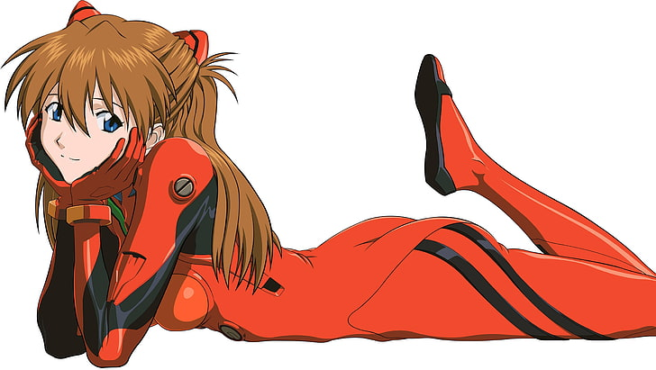

Hello, this is my webpage

 

<h1 style="color:blue;">Machine Learning Bounds</h1>

I gather all these information from ChatGPT. It is a fast way to search for relevant information as it is difficult to find the specific webpage on each topic. You should try to derive the bounds. Although you cannot derive new bounds, deriving old bounds help you understand the techniques and algorithms better.

<h3 style="color:blue;">Batch Size</h3>

Deep learning does stochastic gradient descent. So the gradient is modeled as a determinstic gradient with Gaussian noise added. The variance of the gradient decreases with increase in batch size.

This formula computes the generalization gap of stochastic gradient descent. nt is the learning rate, t is the number of steps, n is the dataset size, and lastly B is the batch size. Increase in batch size will increase learning accuracy assume that there is no overfitting. 

<h3 style="color:blue;">Gradient Descent</h3>

The convergence rate is O(1/t) in deterministic gradient descent. t is the number of gradient descent steps. Basically it means that the loss function will descrease at rate 1/t.

If the loss function is not skewed, e.g. in quadratic loss function, the condition number (largest eigenvalue divided by lowest eigenvalue is small), the loss function will look like a circular bowl with no zig-zag in gradient descent, so it will converge in exponential rate.

For stochastic gradient descent, the decrease rate of loss function is 1/sqrt(t), which is much slower than ordinary gradient descent.

The error bound of stochastic gradient descent can be summarized by 2 terms, one is the deterministic rate 1/t and another is the non-deterministic rate determined by the batch size B.

<h2 style="color:blue;">Stochastic Gradient Descent, Newton Method, Fixed and Decreasing Learning Rate, Conjugate Accelerated Nesterov Gradient Descent, Stability, Sensitivity, Differential Equations Bounds</h2>

<h3 style="color:blue;">VC Dimension</h3>

Vapnik–Chervonenkis dimension is a measure of the capacity of a machine learning model or algorithm. How much information can it learns. Higer VC dim is usually better but it may overfit and learn the noise in the data. We can further fix this by using regularization, which I will talk more in the later part. Some models such as K nearest neighbors classifier has infinite VC dimension. The VC dimension will keep on increasing as the number of data points increase. Non parametric probbability distribution estimation is another example.

<h2 style="color:blue;">Decision Tree, Support Vector Machine, Quadratic Kernels</h2>

The VC dimension of linear SVM is d+1. Because the hyperplane can shatter the input space into D + 1 possible regions. This is the same for perceptron (1 layer) in deep learning. 

For soft margin SVM, the VC dimension increases with slack variable. The slack variable controls the regularization of learning. The higher the slack variable, the lesser the regularization. Usually with high dimension input, we add regularization to avoid overfitting. In the case of deep learning, usually we create a large network to overfit the data, then we add regularization to increase the validation accuracy on the test dataset. The variable inside the f(.) function is the slack variable.

This is the VC dimension of decision tree. Basically it means that decision tree will shatter the input space into 2 to the power of D subspace as represented by the leaves, with D different classes at the leaves. 

<h2 style="color:blue;">Multilayer Perceptron, Ensembles Max and Mean Outputs, Compare Similarity</h2>

Note that the Bagging or Boosting uses majority vote.

There are similarity between multilayer perceptron VC dim and ensembles VC dim. Is there a relationship between them? Can we convert MLP to ensembles learning?

<h2 style="color:blue;">Transformer model, Attention layer</h2>

Transformer model vc dim is same as MLP and it is related to size of attention layer matrix, n^2. Transformer has better scaling law than convolutional network, therefore I think transformer is the future.

<h2 style="color:blue;">Group Convolution, Alexnet double branches bound</h2>

<h3 style="color:blue;">Chebyshev Bound</h3>

<h2 style="color:blue;">Variance Reduction</h2>

<h3 style="color:blue;">Convexity</h3>

<h2 style="color:blue;">Super Convergence, L-smooth Learning Rate, Cross Entropy Loss L-smooth Factor, Quadratic Loss with Large Condition Number, PL Condition</h2>

<h3 style="color:blue;">Sparsity Learning</h3>

Restricted isometry property is when matrix A becomes othonormal when machine learning with sparsity constraints. Sparsity greatly reduces the number of training samples to learn the weights.

Sparsity increases the accuracy bound by sqrt of s where s is the sparsity level.

Sparsity in network reduce the per-step cost of training stochastic gradient descent from W to s.

<h3 style="color:blue;">Support Vector Machine, Number of training samples</h3>

<h3 style="color:blue;">L2 Norm Regularization Bound</h3>

<h3 style="color:blue;">Principal Component Analysis, Linear Discriminant Analysis, Independent Component Analysis Bounds</h3>

<h3 style="color:blue;">Geometric Complexity Entropy Bounds</h3>

<h3 style="color:blue;">Matrix Singular Value Decomposition Bounds</h3>

<h3 style="color:blue;">Genetic Algorithm, Stimulated Annealing, Ant Colony Bounds</h3>

These metaheuristic algorithms have poorer accuracy and convergence rate bounds than deep learning algorithms. The adding of noise in diffusion image generation network is like stimulated annealing algorithm. Genetic algorithm is used in deep learning architecture search. Reinforcement learning algorithm is generally better than genetic algorithm in neural architecture search.

<h3 style="color:blue;">Markov Chain Bounds</h3>

 

<h3 style="color:blue;">Graph Neural Network Convergence Requirements</h3>

Generally, a cycle free graph will have a more stable weights updating.

Asynchronous weights updating is generally more stable than synchronous weights updating. That is also why stochastic gradient descent is better conventional gradient descent.

<h1 style="color:blue;">The End</h1>

